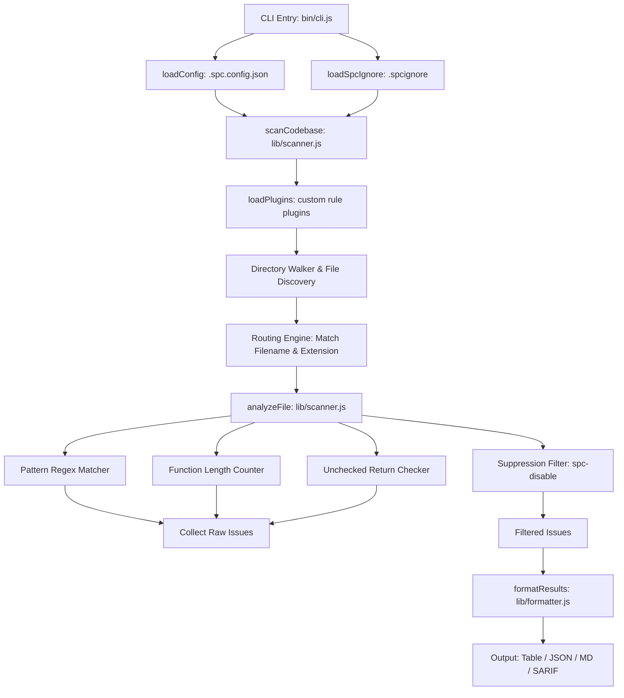

# SPC Architecture & Extensibility Guide

This document details the internal architecture, scan execution pipeline, rule engine schemas, and extension guide for `@putervision/spc` (Space Proof Code).

---

## Scan Execution Pipeline

SPC operates as a zero-dependency static analysis pipeline built entirely on native Node.js filesystem APIs and regex pattern matching algorithms.



---

## Language Pattern Engine Schema

Each language and AI configuration rule engine exports a pattern configuration object:

```javascript
const CustomPatterns = {
  language: 'custom_lang',
  category: 'security', // 'nasa' | 'security' | 'quality' | 'agent'
  extensions: ['.ext1', '.ext2'], // Optional extension routing
  filenames: ['Customfile', 'config.custom'], // Optional filename routing
  patterns: {
    rule_name: /regex_pattern/gi,
  },
  function_regex: /^function\s+\w+/,
  ignore_functions: ['safeFunc'],
  critical_functions: ['criticalFunc'],
  void_return_indicator: 'void',
};

module.exports = { CustomPatterns };
```

---

## Plugin Architecture (`lib/plugin.js`)

SPC automatically loads custom plugins placed in a project's `./plugins` directory or specified via `--config`. A plugin is a JavaScript file exporting a pattern configuration object matching the schema above.

Example custom plugin (`plugins/custom_rules.js`):

```javascript
module.exports = {
  name: 'my_custom_plugin',
  language: 'javascript',
  extensions: ['.js'],
  patterns: {
    custom_forbidden_api: /\bforbiddenApiCall\s*\(/g,
  },
};
```

---

## Contributing New Language Engines

To add support for a new programming language or config file type:

1. Create a new pattern module in `lib/lang/<language>.js`.
2. Register the export in `LANGUAGE_PATTERNS` inside `lib/scanner.js`.
3. Add rule severities and URLs to `PATTERN_INFO` in `lib/info.js`.
4. Add test fixtures in `test/examples/bad-example.<ext>`.
5. Add unit test assertions in `test/scanner.test.js` and `test/patterns.test.js`.
